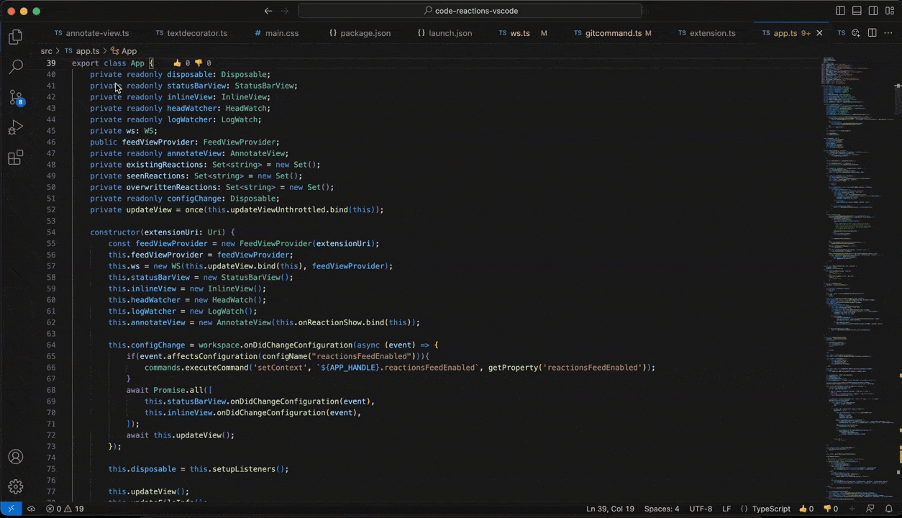
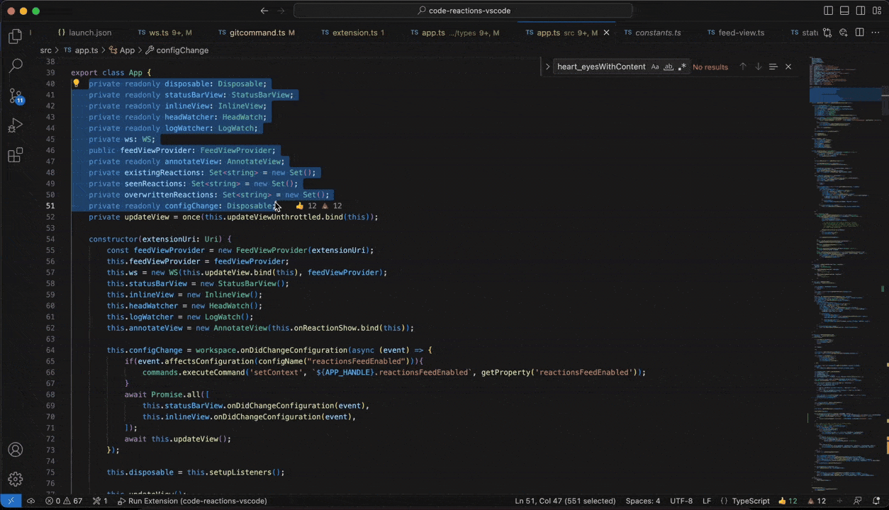
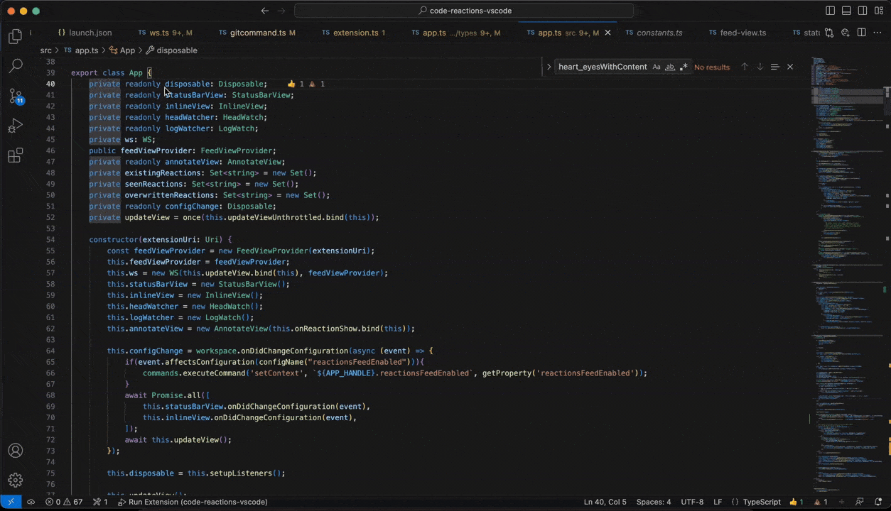
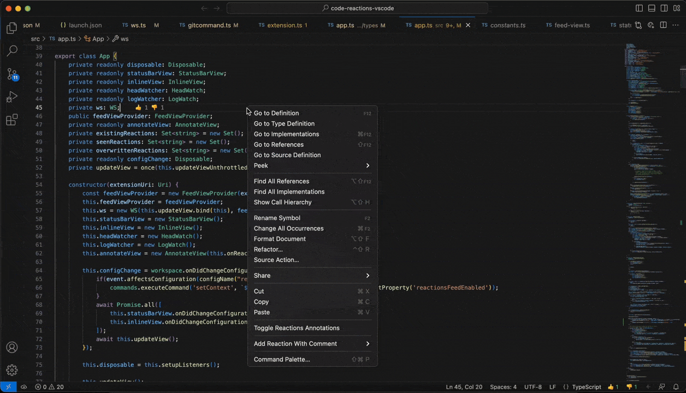
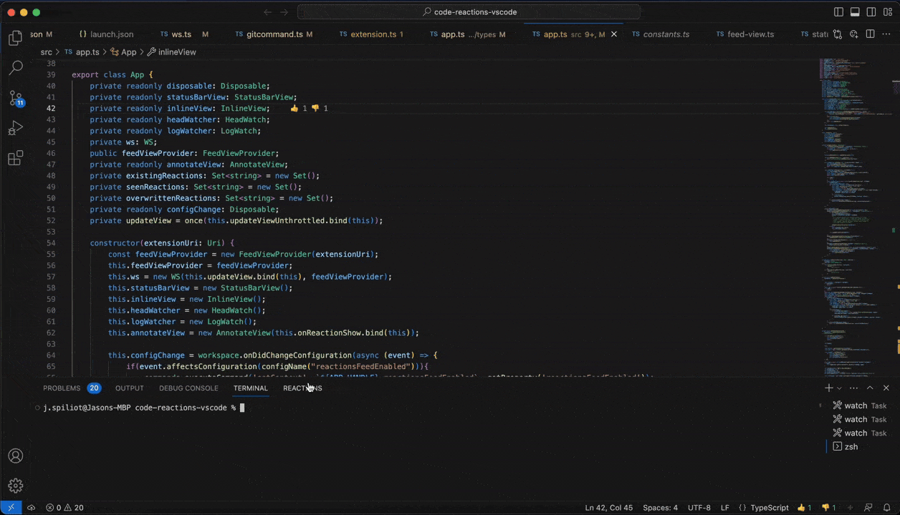
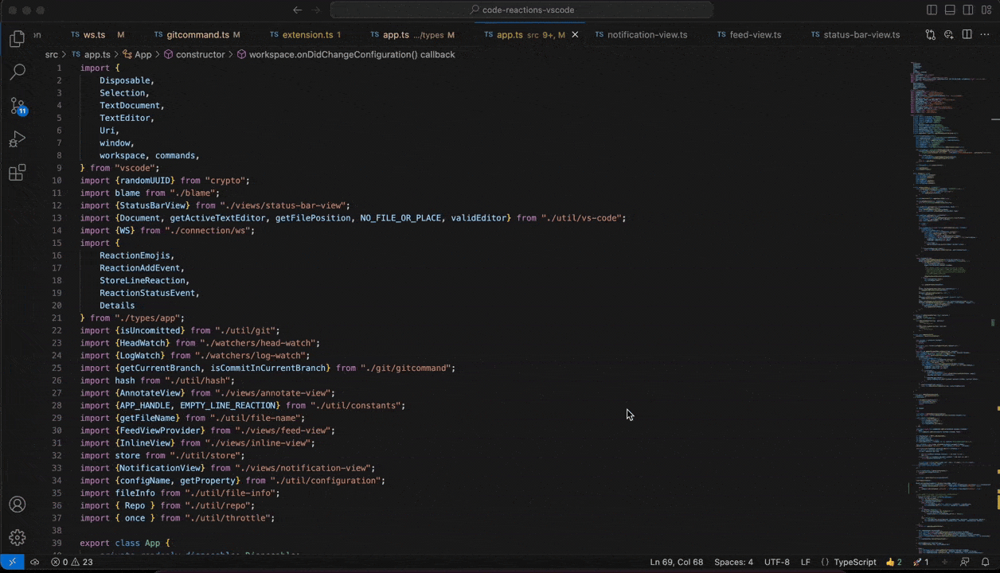

# Code Reactions — Emoji reactions for any Git repo

> Add emoji reactions, even with comments, to any Git repo! React and see others 
> reactions to any piece of code straight from your IDE.

Code Reactions is an open-source extension for Visual Studio Code, made to give back to the community.

You saw some nice piece of code? Now you can add a 👍, or maybe even a 😍 and spread the love.

It seems like there might be a bug there? Give it a 🐛 with a comment on your finding 
and come back to fix it when you get the chance.

This code feels like it has quite a smell... You think it might justify a 💩? Leave it there 
and bring the team around to help you scoop all of these.

We give you the ability to react to any code, you decide how to use it!

## Features and how to use

**In its core there is only a single feature:**
>**React and see reactions to any code**

There are different ways supported by this extension to achieve that. 
All of them can be individually toggled on/off from the settings so feel free to 
choose the ones that work best for you!

### Status Bar Reactions
1. `Select any lines of code` and `see how many reactions` it has on the status bar.
2. `Hover` over the reaction and see by how many people
3. `Click` any emoji to react to these lines yourself

   

### React with Comment
1. `Select any lines of code` and right click
2. Choose `Add Reaction With Content > Any reaction`
3. Add your comment and press `Enter`

   

### Inline Reactions
1. `Select any lines of code` and see how many reactions it has next to your cursor.
2. `Hover` over it and see `when` by `whom` and any `comment` they left

   

### Annotate Code with Reactions
1. Right click on any file lines and select `Toggle Reaction Annotations`
2. `See easily next to each line` any reaction they have.
3. `Hover` any of them so see `when` by `whom` and any `comment` they left

   

### Reactions Feed
1. Click on the `Reactions:Feed` Panel
2. See a chronological list of all repo reactions

   

### Notifications
Get `instantly notified` for any reactions to either `the repo`, or specifically `your code`.

### Supported Reactions
In the future we would like to support any native emoji. Until we figure out
how to do that in a nice UI way this is the list of supported emojis:

| Emoji | Designation    | 
|-------|----------------|
|    👍   | : thumbsup :   |
|    👎   | : thumbsdown : |
|    🐛   | : bug :        |
|    💩   | : poop :       |
|    🚀   | : rocket :     |
|    🤔   | : thinking :   |
|    😍   | : heart_eyes : |
|    👀   | : eyes :       |

## Requirements

This extension relies on Git.

## Extension Settings

This extension contributes the following settings:

| Setting | Type | Default | Description |
|---------|------|---------|-------------|
|code-reactions.inlineMessageEnabled|boolean|true|Show reactions inline (next to the code)|
|code-reactions.inlineMessageMargin|number|2|The amount of margin between line and inline reactions|
|code-reactions.inlineMessageNoCommit|string|Not Committed Yet|Customize the inline message|
|code-reactions.inlineProminentReactionsAmount|number|2|The amount of reactions that will be shown on inline reactions|
|code-reactions.statusBarReactionsEnabled|boolean|true|Whether the status bar reactions exist|
|code-reactions.statusBarMessageNoCommit|string|Not Committed Yet|Customize the status bar message|
|code-reactions.statusBarProminentReactionsAmount|number|2|The amount of reactions (without the ➕) that will be shown on the status bar reactions|
|code-reactions.newReactionNotificationsEnabled|boolean|true|Enable received new reaction notifications|
|code-reactions.newReactionNotificationsOnlyOnMyLines|boolean|false|Get notifications for reactions that happened only on lines you have authored|
|code-reactions.reactionsFeedEnabled|boolean|true|Whether the reactions feed panel exists|

## FAQs
### Do reactions follow the code through changes?
Reactions follow the line as long as the line exists and it's not modified. Note that whitespace changes,
or moves of the line due to other lines being added or removed **do not** constitute a change. However, modifying
in any way the text of the line, removes all reactions from that line.

## Support and Community
Join our [community on Discord](https://discord.gg/HZhuynMRsN) to connect with other users, share your experiences, 
and chat about coding, or anything really.

## Issue Reporting and Feature Requests
Found a bug? Have a feature request? Reach out on our [GitHub Issues page](https://github.com/AdadotTeam/vscode-reactions/issues).

## Contributing
Core reactions is an open-source project. We highly value andy contributions and feedback from the community!

Your contributions, feedback, and engagement would be invaluable, 
and we would love for you to play a significant role in shaping the future of Code Reactions. Thank you for your support!

## Code Contributions
Want to contribute code? Follow the [CONTRIBUTING](https://github.com/AdadotTeam/vscode-reactions/blob/main/CONTRIBUTING.md) docs to get started.

## Documentation Contributions
Contributions to the documentation are greatly appreciated. 
If you find any areas that can be improved or have suggestions for new documentation, 
you can submit them as pull requests to the [Code Reactions repository](https://github.com/AdadotTeam/vscode-reactions).

**Enjoy!**